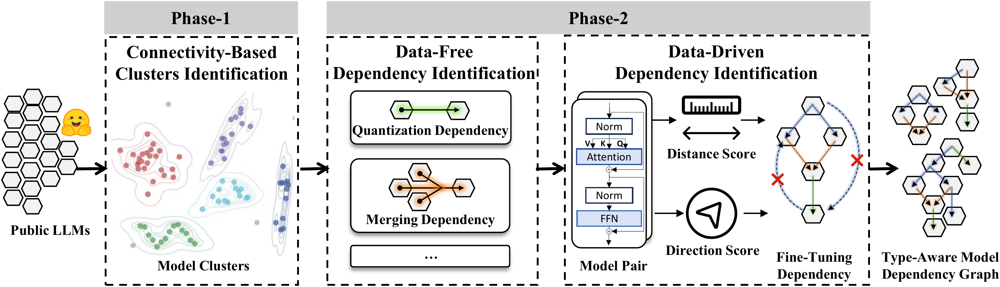
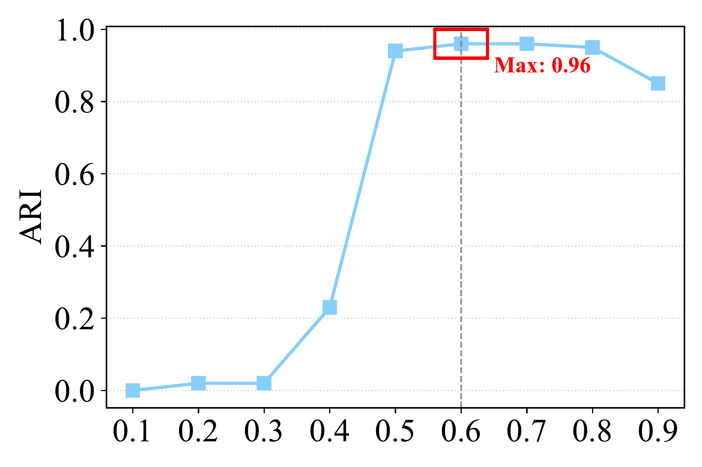
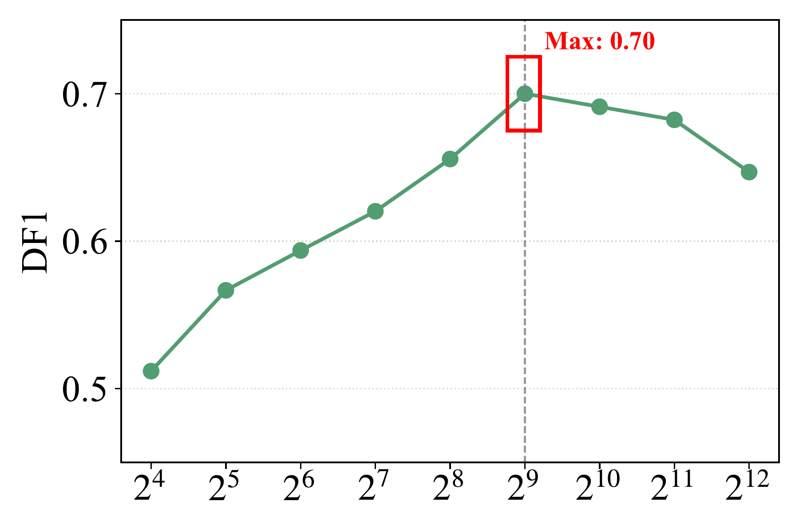

# TensorLock : Recovering Model Dependency for Model Supply Chain



$TensorLock$ is a comprehensive framework designed to recover dependency relationships among transformer-based models in the model supply chain. By analyzing model weights, metadata, and structural properties, $TensorLock$ constructs a **Type-Aware Model Dependency Graph (MDG)** that reveals how models are derived from others (e.g., via fine-tuning, quantization, merging), even when such information is missing or incorrect in model cards.

## Project Structure

* `main.py`: Entry point for running the complete $TensorLock$ pipeline.
* `code/`: Core implementation of $TensorLock$.
* `dataset/`: Model list and cluster of $MDGBench$.
* `empirical/`: Empirical data and analysis results.
* `chron/`: Implementation of chronology-based dependency identification.
* `usefulness/`: Data of 289 isolated models.
* `figs/`: Figures.
* `requirements.txt`: Project dependencies.

## Installation

1. **Clone the repository**:
```bash
git clone https://github.com/TensorLock/TensorLock.git
cd TensorLock
```


2. **Install dependencies**:  Ensure you have Python 3.8+ installed.
```bash
pip install -r requirements.txt
```

## Usage

**Run the full pipeline:**

```bash
python main.py
```

**Skip model downloading:**

```bash
python main.py --skip-download
```

**Start from a specific step (e.g., Step 5):**

```bash
python main.py --start-from 5
```

---

## Empirical Study

We conducted an empirical study on the 369 models sampled from the top 10,000 most downloaded models on Hugging Face to understand dependency prevalence and opacity. Raw Data Available in [empirical.csv](./empirical/empirical.csv).

* **RQ1: Dependency Prevalence & Opacity**: Model reuse is pervasive (81.8%), yet **53.6% of identified dependencies were absent from model cards**, leading to significant supply chain risks.

* **RQ2: Dominant Architectures**: **96.4%** of all identified dependency edges occur between **transformer-based models**.

* **RQ3: Dependency Types**: Dependencies are diverse, with **97.7%** concentrated in Fine-Tuning (FFT/PEFT), Quantization (QT), and Merging (MG).


<div align="center">

**Table 1 : Distribution of Model Dependency Type Across Domains** 

| Domain | FFT | QT | MG | PEFT | Distill | Convert | RL | Total |
| :---: | :---: | :---: | :---: | :---: | :---: | :---: | :---: | :---: |
| **NLP** | 100 | 59 | 16 | 3 | 2 | 1 | 1 | **182** |
| **CV** | 7 | 4 | 1 | 2 | 0 | 0 | 0 | **14** |
| **Audio** | 12 | 0 | 0 | 0 | 0 | 1 | 0 | **13** |
| **Multimodal** | 5 | 3 | 1 | 2 | 0 | 0 | 0 | **11** |
| **Other** | 2 | 0 | 0 | 0 | 0 | 0 | 0 | **2** |
| **Total** | **126** | **66** | **18** | **7** | **2** | **2** | **1** | **222** |
</div>

---

## Evaluation Results

We evaluated $TensorLock$ on **$MDGBench$**, a comprehensive benchmark featuring 137 real-world models and 131 dependency edges across multiple domains.

### 1. Phase-1: Clustering Effectiveness (RQ4)
In Phase-1, we evaluated $TensorLock$'s ability of clustering by comparing it with both white-box and black-box state-of-the-art fingerprinting methods on the $MDGBench$ dataset. 

<div align="center">

**Table 2 : Clustering Evaluation Results on $MDGBench$**

| Method             | ARI | Type       | Paper | 
|:--------------------:|:---:|------------|-------------------|
| $SEF$               | 0.10                 | Black      | [SoK: Large Language Model Copyright Auditing via Fingerprinting](https://arxiv.org/abs/2508.19843) |
| $LLMMap$            | 0.12                 | Black      |[LLMmap: Fingerprinting For Large Language Models](https://arxiv.org/abs/2407.15847) |
| $MET$               | 0.06                 | Black      |[Model Equality Testing: Which Model is this API Serving?](https://openreview.net/forum?id=QCDdI7X3f9) |
| $TRAP$              | 0.02                 | Black      |[TRAP: Targeted Random Adversarial Prompt Honeypot for Black-Box Identification](https://aclanthology.org/2024.findings-acl.683.pdf) |
| $PDF$               | 0.52                | White      |  [Intrinsic Fingerprint of LLMs: Continue Training is NOT All You Need to Steal A Model!](https://arxiv.org/abs/2507.03014) |
| $HuRef$             | 0.69                | White      | [HuRef: HUman-REadable Fingerprint for Large Language Models](https://proceedings.neurips.cc/paper_files/paper/2024/hash/e46fc33e80e9fa2febcdb058fba4beca-Abstract-Conference.html) |
| $REEF$              | 0.29                | White      | [REEF: Representation Encoding Fingerprints for Large Language Models](https://arxiv.org/abs/2410.14273) |
| $MoTHer$            | 0.50                | White      | [UNSUPERVISED MODEL TREE HERITAGE RECOVERY](https://arxiv.org/pdf/2405.18432) |
| $TensorGuard$       | 0.31                | White      | [Gradient-Based Model Fingerprinting for LLM Similarity Detection and Family Classification](https://arxiv.org/abs/2506.01631) |
| **$TensorLock (Ours)$** | **0.96**         | White      | [This Repo](https://github.com/TensorLock/TensorLock)          | 

</div>


---

> $TensorLock$ achieves a **39% improvement** over $HuRef$, demonstrating superior robustness in handling complex, non-linear dependency chains.

---

### 2. Phase-2: Dependency Identification  (RQ4)

This evaluation focuses on the precision, recall, and **Dependency F1 (DF1)** score for recovering the exact edges and types in the supply chain. 

<div align="center">

**Table 3 : Dependency Identification Evaluation Results on $MDGBench$**

| Method | Precision | Recall | DF1 | Reachability | Code |
| :---: | :---: | :---: | :---: | :---: |--- |
| **$MoTHer$** | 0.04 | 0.04 | 0.04 |0.05| [Link](https://github.com/eliahuhorwitz/$MoTHer$) |
| **$MoTHer^+$** | 0.29 | 0.26 | 0.28 |0.47| [Link](https://github.com/eliahuhorwitz/$MoTHer$) |
| **$ChronChain$** | 0.13 | 0.13 | 0.13 | 0.97 |[Link](./chron/recovery.py)|
| **$ChronChain^+$** | 0.29 | 0.27 | 0.28 | 0.97 |[Link](./chron/recovery.py)|
| **$TensorLock(Ours)$** | 0.81 | 0.75 | 0.78 | 0.77 |[Link](./main.py)|
| **$TensorLock^+ (Ours)$** | **0.83** | **0.81** | **0.82** | **0.81** |[Link](./main.py)|
</div>

> **$TensorLock^+$** (our method with previous knowledge) achieves the highest performance, outperforming the tree-based $MoTHer^+$ by **193%** in DF1 score.

---

### 3. Ablation Study  (RQ5)

We conducted an ablation study to evaluate the contribution of each key component. 

<div align="center">

**Table 4: Ablation Study Results of $TensorLock$ on $MDGBench$**

| Configuration | ARI | Precision | Recall | **DF1** | Reachability | 
| --- | :---: | :---: | :---: | :---: |:---: |
| $w/W_{FFN}$ (Δ) | -0.21 | -0.07 | -0.18 | -0.13 | -0.27|
| $w/ W_{MSA}$ \& $W_{FFN}$ (Δ)| -0.05 | -0.04 | -0.14 | -0.10 |  -0.18|
| $w/o$ $Ku.$ (Δ)| $\pm 0$ | -0.07 | -0.09 | -0.08 | -0.03|
| $w/o$ $D.F.$ (Δ)| $\pm 0$ | -0.17 | -0.19 | -0.18 | -0.28|
| **$TensorLock$** | **0.96** | **0.81** | **0.75** | **0.78** | **0.77**|

</div>

> Ablation results demonstrate that each component of $TensorLock$ contributes positively to the overall performance.
---

### 4. Sensitivity Analysis (RQ6)

<table align="center">
  <tr>
    <td></td>
    <td></td>
    <td></td>
  </tr>
  <tr align="center">
    <td>(a) &tau;<sub>conn</sub> </td>
    <td>(b) &vert;B&vert; </td>
    <td>(c) &tau;<sub>mg</sub> </td>
  </tr>
</table>

> $TensorLock$ achieves the optimal performance when $\tau_{conn} = 0.6$, $|B| = 2^9 (512)$, and $\tau_{mg} = 0.9$.


---

### 5. Efficiency Evaluation (RQ7)

<div align="center">

**Table 5: Efficiency Evaluation on $MDGBench$**

| Method | Clustering | Dependency Identification | Total Time |
| :---: | :---: | :---: | :---: |
| **$TensorGuard$** | 25,350s |-  |  25,350s |
| **$MoTHer$** | 1,052s | 1,041s | 2,093s |
| **$TensorLock(Ours)$** |  **963s** | **1,659s** | **2,622s** |

</div>


> While achieving significantly higher accuracy, $TensorLock$ maintains high efficiency by operating on static weights, avoiding the heavy computational overhead of gradient-based methods like TensorGuard.
---

### 6. Usefulness  (RQ8)

We applied $TensorLock$ to 289 isolated models  (those lacking dependency metadata) on Hugging Face.  Raw Data Available in [usefulness.csv](./usefulness/usefulness.csv).

> * Identified missing dependencies for **189 (65%)** of these models.
> * To date, **42 model authors** have confirmed our findings and updated their model cards accordingly.
